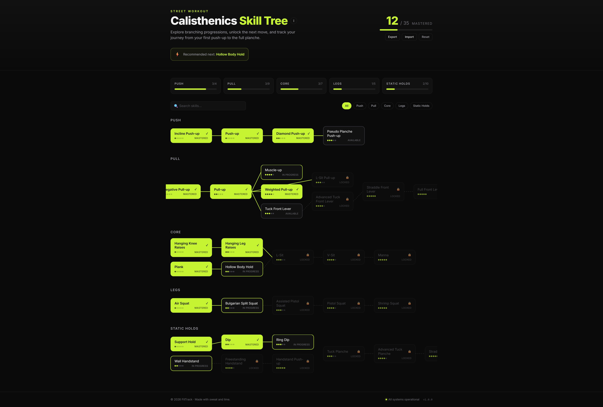

# 🤸 Calisthenics Skill Tree

> An interactive progression tracker for calisthenics & street workout — explore branching skill paths from your first push-up to the full planche, and track what you've mastered.



Everything runs client-side. Your progress is saved to `localStorage`, with JSON
export/import so you can back it up or move between devices. No backend, no
account, no tracking.

## ✨ Features

- **Interactive skill tree** — skills grouped by category with connector lines
  drawn between each move and its prerequisites. Nodes are colour-coded by state
  (locked · available · in progress · mastered).
- **Skill detail panel** — click any node for its description, the requirement to
  master it, its prerequisites (with live status), and progress controls.
- **Progress tracking** — per-category progress bars plus an overall
  "X / Y mastered" stat in the header.
- **Recommended next skill** — a smart highlight suggests the best move to chase
  based on what you've unlocked.
- **Search & filter** — find a skill by name or narrow the tree to a category.
- **Persistence** — progress is saved locally and restored on reload.
- **Export / import** — download your progress as JSON and re-import it later.
- **Reset** — clear everything behind a confirmation step.
- **Polished, responsive UI** — dark "athletic minimalism" theme, mobile-first.

## 🛠 Tech stack

- [React 18](https://react.dev/) + [TypeScript](https://www.typescriptlang.org/)
- [Vite](https://vitejs.dev/) for dev/build
- [Tailwind CSS](https://tailwindcss.com/) for styling
- [Vitest](https://vitest.dev/) + [React Testing Library](https://testing-library.com/) for tests
- ESLint + Prettier

## 🚀 Getting started

```bash
# install dependencies
npm install

# start the dev server (http://localhost:5173)
npm run dev

# run the test suite
npm test

# type-check and build for production
npm run build

# preview the production build
npm run preview
```

## 🧠 How it works

All the progression logic lives in [`src/lib/tree.ts`](src/lib/tree.ts) as pure,
framework-free functions — which is what makes it easy to unit-test.

The user only ever stores *intent*: a map of skill id → `"in_progress"` or
`"mastered"`. The displayed state of every skill is **derived** from that map on
each change:

- A skill is **locked** if any prerequisite isn't `mastered` yet.
- It becomes **available** once all prerequisites are `mastered`.
- Root skills (no prerequisites) start **available**.
- The user cycles a skill `available → in_progress → mastered → available`.

Because state is recomputed from scratch every time, mastering a node
automatically **unlocks** everything downstream — and un-mastering it
**re-locks** the chain — with no stale state to manage.

```
Incline Push-up → Push-up → Diamond → Pseudo Planche → Tuck Planche → … → Full Planche
```

Persistence and JSON export/import live in
[`src/lib/storage.ts`](src/lib/storage.ts), and both layers are wired into the UI
through the [`useSkillTree`](src/hooks/useSkillTree.ts) hook.

## 🧪 Testing

- `tests/tree.test.ts` — the unlock cascade, re-locking downstream nodes,
  progress percentages, the recommendation engine, and seed-data integrity.
- `tests/storage.test.ts` — `save → load` and `export → import` round-trips, plus
  corrupt-input handling.
- `tests/app.test.tsx` — component test: clicking a node opens the detail panel,
  mastering a skill updates its state, and search filters the tree.

```bash
npm test
```

## 📁 Project structure

```
src/
  components/      # SkillNode, SkillTree, SkillDetailPanel, CategoryProgress, Header, SearchFilter
  data/skills.ts   # the typed progression data (35 skills across 5 categories)
  lib/tree.ts      # pure unlock logic + progress math (fully tested)
  lib/storage.ts   # localStorage + JSON import/export
  hooks/useSkillTree.ts
  App.tsx
tests/             # tree, storage, and component tests
```

## 📄 License

MIT — see [LICENSE](LICENSE).
